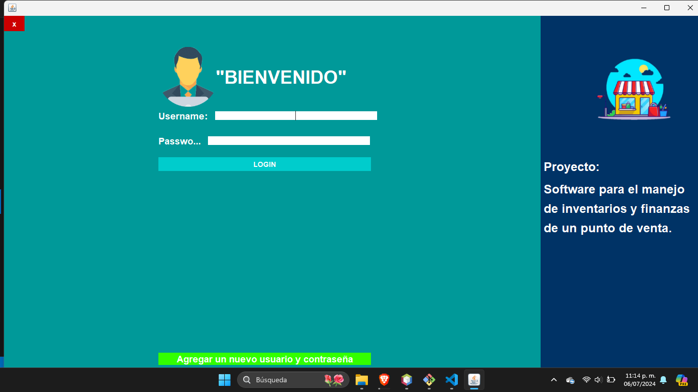

# Gestión de Inventario

Este es un programa de gestión de inventario desarrollado en Java utilizando NetBeans IDE. El programa permite gestionar productos, categorías, proveedores y generar reportes visuales utilizando gráficos. Para la generación de gráficos, se requiere la librería JFreeChart.

## Características

- Gestión de productos
- Gestión de categorías
- Gestión de proveedores
- Generación de reportes visuales
- Interfaz de usuario amigable

## Requisitos

- Java Development Kit (JDK) 8 o superior
- NetBeans IDE 8.2 o superior
- Librería JFreeChart

## Instalación

### Paso 1: Descargar el proyecto

1. Clona el repositorio o descarga el archivo ZIP del proyecto:
   ```sh
   git clone https://github.com/Chris3riel/GestorInventario-Java.git
   ```

### Paso 2: Abrir el proyecto en NetBeans

1. Abre NetBeans IDE.
2. Selecciona `File > Open Project`.
3. Navega a la carpeta donde descargaste el proyecto y selecciónalo.

### Paso 3: Descargar e importar JFreeChart

1. Descarga la librería JFreeChart desde su sitio web oficial: [JFreeChart Download](http://www.jfree.org/jfreechart/download.html)
2. Extrae el contenido del archivo ZIP descargado.
3. En NetBeans, haz clic derecho en el proyecto y selecciona `Properties`.
4. En la categoría `Libraries`, selecciona `Add JAR/Folder`.
5. Navega a la carpeta donde extrajiste JFreeChart y selecciona los archivos JAR necesarios (`jfreechart-x.y.z.jar` y `jcommon-x.y.z.jar`).
6. Haz clic en `OK` para agregar las bibliotecas al proyecto.

## Uso

1. Ejecuta el proyecto en NetBeans.
2. Utiliza la interfaz gráfica para gestionar productos, categorías y proveedores.
3. Genera reportes visuales a través de la opción correspondiente en el menú.

## Capturas de Pantalla



## Contribución

Si deseas contribuir a este proyecto, por favor sigue los siguientes pasos:

1. Haz un fork del proyecto.
2. Crea una nueva rama (`git checkout -b feature/nueva-funcionalidad`).
3. Realiza los cambios y haz commit (`git commit -am 'Agregar nueva funcionalidad'`).
4. Sube los cambios a tu repositorio (`git push origin feature/nueva-funcionalidad`).
5. Abre un Pull Request.

## Licencia

Este proyecto está licenciado bajo la Licencia MIT. Consulta el archivo [LICENSE](LICENSE) para más detalles.

## Contacto

Para cualquier consulta o sugerencia, puedes contactarme a través de mi correo electrónico: tu-email@ejemplo.com.

---

Si necesitas alguna modificación o tienes algún detalle adicional que desees incluir, házmelo saber.